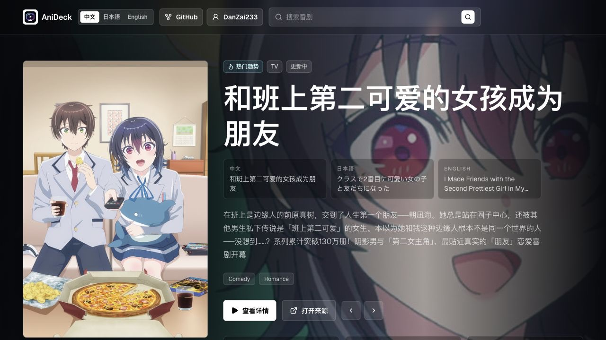
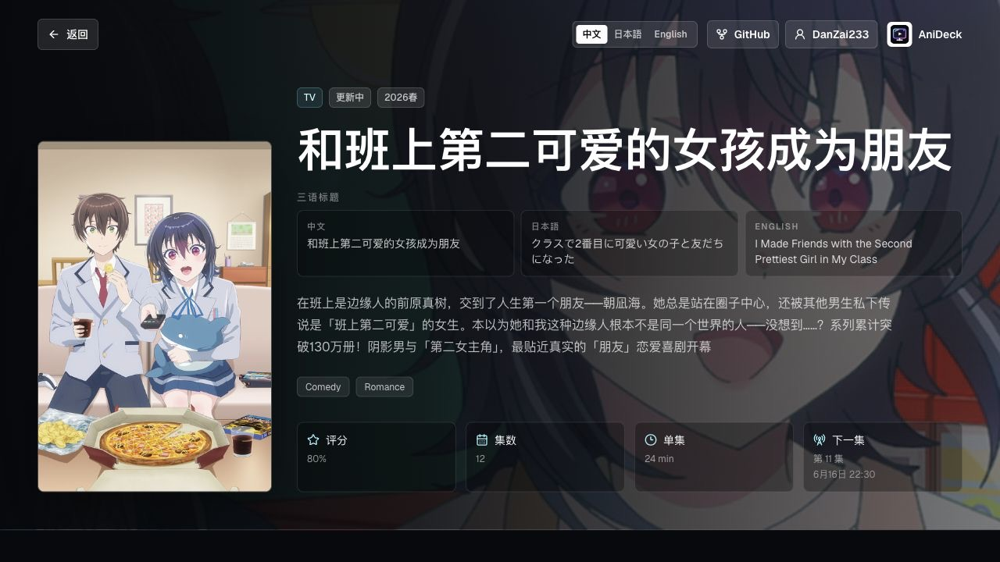

最近又做了一个新项目：**AniDeck**。

它是一个 Apple TV 风格的番剧信息聚合站。简单说，就是把热门番剧、连载中番剧、季度新番、待播作品、角色信息、新闻动态和官方观看入口放进一个海报优先的浏览界面里。

线上地址：[anime.danzaii.cn](https://anime.danzaii.cn)  
GitHub：[DanZai233/AniDeck](https://github.com/DanZai233/AniDeck)

<!--more-->

## 为什么想做 AniDeck

我一直觉得追番这件事，其实不只是“找一部动画点进去看”。

很多时候，我们会先被一张海报吸引，然后想知道它是什么类型、现在播到哪里、评分怎么样、角色是谁、有没有中文标题、能不能找到官方观看入口，甚至还会顺手去萌娘百科看看角色条目。

这些信息分散在不同网站上当然也能查，但体验上总有一点割裂。

所以 AniDeck 想做的是一个自己的番剧入口：打开之后先看到一组很有视觉冲击力的海报和横向卡片，再慢慢点进详情页，把作品信息、角色、来源和新闻串起来。

不是做一个“资源站”，而是做一个干净的 **Anime information deck**。

## 海报优先的浏览体验

AniDeck 的第一眼是很重要的。

这次我没有做传统的表格或列表，而是用了更接近 Apple TV 的视觉语言：

- 大幅 hero 轮播；
- 深色背景和海报焦点；
- 横向滚动 rails；
- 评分、年份、状态直接叠在卡片上；
- 详情页用 banner + cover 的电影海报式布局。

首页现在分了几组：

| 分区 | 内容 |
|---|---|
| Trending | 热门趋势 |
| On Air | 正在播出 |
| Season | 当季番剧 |
| Coming | 即将开播 |
| News | 动漫新闻 RSS 聚合 |

最近还加了旋转 hero carousel，让首页不只是静态展示一部作品，而是能在热门作品之间切换。这个改动让站点一下子更像一个真正的“番剧客厅”。

## 详情页：不只是一张海报

点进详情页之后，AniDeck 会把作品信息展开：

这里主要包括：

- 中文 / 日文 / 英文三语标题；
- 简介、类型、季度、状态；
- 评分、集数、单集时长、下一集播出时间；
- 角色卡片、声优、AniList 详情链接；
- 萌娘百科搜索入口；
- 官方来源和平台搜索入口；
- 可用时展示逐集 streaming episode 链接。

我很喜欢“三语标题”这个设计。

因为番剧经常有中文译名、日文原名、英文标题，单独看一个有时会对不上。把三种标题并排放出来之后，查作品时会顺很多，也更适合中文用户浏览海外数据源。

## 数据源拼起来

AniDeck 现在主要接了这些公开数据源：

| 数据源 | 用途 |
|---|---|
| AniList GraphQL | 热门番剧、详情、角色、外部链接、部分播放入口 |
| Bangumi API | 中文标题和中文简介补全 |
| Moegirl MediaWiki API | 作品页和角色条目搜索 |
| Anime News Network RSS | 动漫新闻 |
| MyAnimeList RSS | 动漫新闻 |
| Jikan / MAL public data | 补充外部链接 |

这个项目有意思的地方在于：单个数据源都不完美，但拼起来之后体验就完整很多。

AniList 的结构化数据很强，适合做主干；Bangumi 对中文标题和中文简介很有帮助；萌娘百科适合查中文社区里的角色条目；RSS 则给首页补了一点“正在发生”的动态。

## 合法来源边界

这个项目我特意把边界写得很清楚：**AniDeck 不做盗版播放，不抓盗版站，不绕登录，不破 DRM，不存视频，也不代理视频文件。**

这里所谓的“播放来源”，指的是官方平台页面、公开元数据返回的 source link，或者官方平台搜索页。

换句话说，它更像一个入口和索引，而不是播放器。

这点对我来说挺重要的。动漫站如果一不小心就很容易滑向“资源聚合”，但 AniDeck 的定位不是这个。它只聚合公开元数据、新闻、百科搜索和官方 / 授权入口。

干净一点，也更能长期放着。

## 技术栈

这次技术栈是：

- Next.js 16 App Router
- React 19
- TypeScript
- Tailwind CSS v4
- Vercel
- RSS parser / AniList GraphQL / MediaWiki API

项目也内置了几个 API route：

| 路由 | 用途 |
|---|---|
| `/api/anime` | 首页番剧数据和搜索 |
| `/api/anime/[id]` | 番剧详情 |
| `/api/news` | RSS 新闻聚合 |
| `/api/refresh` | 缓存预热 |
| `/api/health` | 上游健康检查 |

`vercel.json` 里也配了每日 refresh cron，用来预热常用数据路径。自己部署的话，也可以用普通 server + PM2 + Nginx，README 里已经写了部署方式。

## 最近这波更新

从提交记录看，AniDeck 是 6 月 9 日一口气搭起来并打磨了一轮：

- 初始化 Next.js 应用；
- 改进角色详情数据源；
- 增加生产健康检查和 SEO 保护；
- 加入旋转 hero carousel；
- 添加站点图标和项目 credits；
- 优化移动端响应式布局；
- 最后完善 README 和仓库元信息。

这很像我最近做项目的节奏：先把 MVP 跑通，然后快速补齐“像一个真实项目”的部分，比如图标、README、健康检查、移动端、部署说明、法律边界。

以前可能会觉得这些是边角料，但现在越来越觉得，这些东西其实是在告诉别人：这个项目是可以被认真打开、认真部署、认真继续改的。

## 做完之后

AniDeck 目前还很轻，但方向我挺喜欢。

它不是一个复杂的社区，也不是要替代任何番剧数据库。它更像一个我自己的追番入口：打开之后先看见漂亮海报，再顺着兴趣点进详情，看看角色，看看新闻，最后去官方入口继续往下走。

接下来可以继续加：

- 用户 watchlist；
- 更多地区的官方来源模板；
- 更稳定的缓存层；
- 更完整的 README 截图；
- 甚至做一个轻量配置后台。

不过现在这个版本已经有雏形了。

如果你也想自部署一个干净的番剧信息首页，可以看看这个项目：

[github.com/DanZai233/AniDeck](https://github.com/DanZai233/AniDeck)

也可以直接打开在线站点逛一圈：

[anime.danzaii.cn](https://anime.danzaii.cn)
