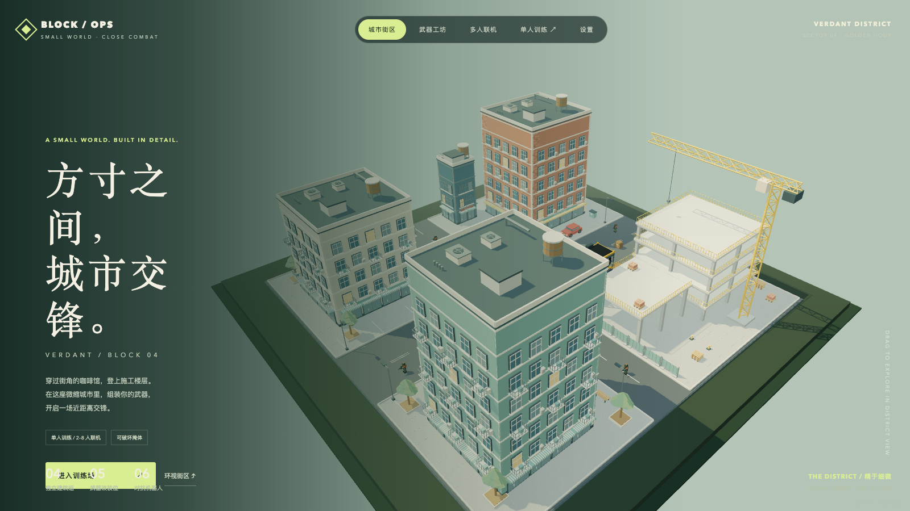
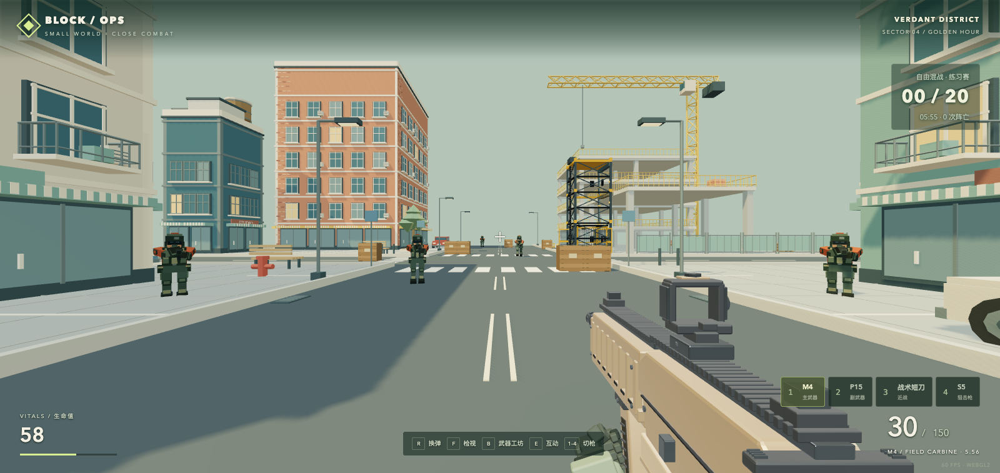
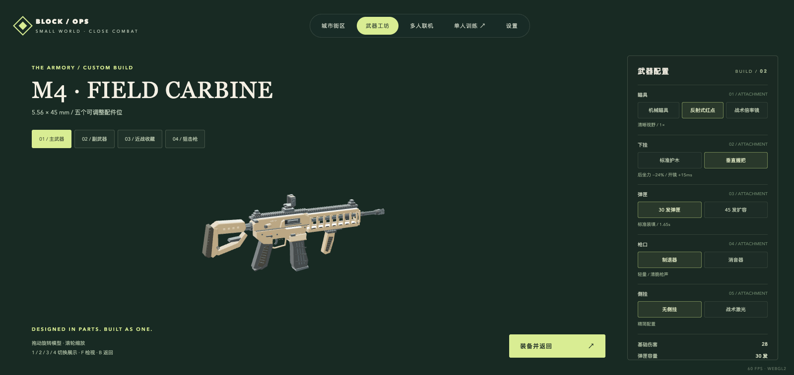

9 月项目回顾里没有把这款游戏写进去，因为它已经不只是“顺手做了一个小东西”，值得单独留一篇。

游戏叫 **BLOCK / OPS · 方寸城市**，现在可以直接在线玩：

> [https://game.danzaii.cn](https://game.danzaii.cn)

它是一个原创微缩城市 FPS 原型。地图不大，但能从街角一路打到施工楼层；核心不是堆资产，而是尝试把移动、射击、命中、计分、房间和服务器校正这条完整链路真正跑起来。

<!--more-->

## 把战场缩进一座微缩城市

我不想从一张无边无际的大地图开始。对独立原型来说，地图越大，越容易把时间和性能浪费在玩家根本不会注意的地方。

所以这次选择了一座可以一眼看懂的小城：砖红、米白和青绿色住宅楼，临街店铺、屋顶机组、空调外机、道路和斑马线；街道上有车辆、长椅、消防栓、围挡、托盘、砖堆和施工设备。住宅楼主要以完整外观建模，可上到二层的施工平台则做成了真正能行走、交战的空间。

城市和 M4 风格步枪来自 Blender 原创资产。P15、S5、五类近战以及人物关节模型则在运行时程序化生成，没有直接拿现成游戏资源来拼。这种做法保住了原型的一致性，也方便后续继续改结构、配件和涂装。

地图里还有一台能在地面和二层之间运行的工业升降梯。玩家可以呼叫、进入和切换楼层；木箱能被打碎，原本的遮挡与碰撞也会一起消失。东西不算多，但每一个都要能和射击、碰撞与服务器状态对齐。

## 枪不能只是换一个模型

目前有四个武器槽：

- **M4 自动步枪**：按住左键连射，可以更换瞄具、握把、弹匣、枪口和激光五个配件位。
- **P15 半自动手枪**：15 发弹匣，作为切枪后继续作战的副武器。
- **S5 栓动狙击枪**：5 发弹匣、25 发备弹、5× 瞄具，身体基础伤害 90，爆头可以击杀满血目标。
- **近战收藏**：战术短刀、爪子刀、蝴蝶刀、战术手斧和胁差，每种六套涂装，共 30 种组合。

三种枪械各自维护弹匣和备弹，切枪不会凭空补满子弹，也不会跳过拉栓、换弹或攻击冷却。近战分成不同伤害、距离和攻击间隔，但皮肤只改变外观，不改变数值。

命中反馈也单独做了一套：准星命中标记、伤害数字、命中与爆头音效、人物受击闪光，以及击杀横幅和连续击杀提示。多人模式只在服务器确认伤害后显示命中，不把客户端的开枪动画直接当成结果。

## 联机才是最麻烦的部分

如果只是让几个模型在浏览器里移动，这个项目会轻松很多。但真正开始做多人之后，每个动作都要重新回答一次：以谁的结果为准？

现在支持两种模式：

- **团队死斗**：最多 4v4，50 分或 6 分钟结算，自动分队并关闭队友伤害。
- **自由混战**：最多 8 人，20 次击倒或 6 分钟结算。

移动、碰撞、弹药、伤害、计分、木箱破坏和电梯状态都由 Node 权威服务器确认。客户端做本地预测，收到服务器校正后平滑回正；其他玩家的位置则通过插值显示。房间之间彼此隔离，每台服务器最多保留 4 个房间，无人房间会自动删除。

为了不把首屏资源做成一团，这轮也压缩了 GLB、JavaScript、CSS 和 WebSocket 快照。初始资源从约 10.1 MiB 降到了约 1.7 MiB。对于一个浏览器 FPS 来说，能否快速进入场景，本身就是体验的一部分。

## Astra 在这款游戏里做了什么

这里要先说清楚：**Astra 是开发协作工具，游戏引擎是 Three.js。**

这次主要是我负责方向、玩法取舍、审美判断和不断试玩，Astra 负责把大量想法落成代码与资产。具体包括城市和 M4 的 Blender 生成脚本、Three.js 场景、程序化武器与人物模型、TypeScript 构建、Node 权威服务器、WebSocket 协议、客户端预测，以及覆盖弹药守恒、伤害遮挡、房间隔离和双客户端同步的测试。

武器工作坊也是这种协作方式的一部分。四种武器可以在线旋转、缩放和切换配件，步枪五类配件会同时改变模型与射击参数，配置保存在浏览器里。它不是只给截图看的展示页，而是一套真的会影响下一局手感的装备系统。

## 它现在真实的样子

这是一款能玩的原型，不是一款已经达到商业质量的 FPS。

机器人只会简单的视线检测、追击和重生，不具备完整寻路与楼层战术；多人有预测、校正和插值，但还没有历史命中回溯、掉线身份恢复、账户系统、完整反作弊和匹配系统。高延迟下的命中与位置回正仍然需要继续优化。目前也只做过双人公网功能验证，不能据此声称已经扛得住长期满载对战。

但这些限制并不妨碍它先成为一个完整的作品。它已经有地图、武器、配件、机器人、计分、房间、部署和明确的技术边界，而不是停留在“以后有空再做”的技术演示。

如果你用桌面浏览器，可以打开 [game.danzaii.cn](https://game.danzaii.cn) 进入训练场试试。它会继续更新，但这一次，我想先让它真正站到线上。
