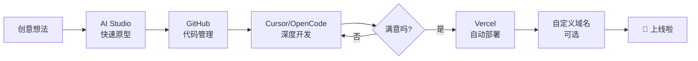

## 前言

经常有人问我："怎么快速实现一个创意想法，然后把它部署成一个可以访问的网站？"

今天就来分享一下我的完整工作流，从灵感到上线的全流程。这个工作流不仅高效，而且大部分工具都是免费的，非常适合个人开发者快速验证想法。

---

## 🎨 第一步：快速原型 - AI Studio

当有一个创意想法时，我会第一时间打开 [Google AI Studio](https://aistudio.google.com)。

### 为什么选择 AI Studio？

- **完全免费**：免费额度足够个人使用，不需要担心成本问题
- **多模态支持**：可以上传图片、文件进行多模态交互
- **一键生成代码**：自然语言描述即可生成完整的前端页面
- **实时预览**：在网页上就能看到效果，不需要本地配置环境
- **部署就绪**：生成的代码可以直接关联到 GitHub

### 典型使用场景

```
我："帮我创建一个简洁的个人导航页面，包含项目卡片、社交链接，使用粉色主题，响应式设计"

AI Studio：几秒钟生成完整的 HTML/CSS/React 代码
```

AI Studio 的"构建模式"特别适合 vibe coding，你可以：
- 用自然语言描述需求
- 实时调整设计细节
- 查看实时效果
- 一键导出代码

### 小贴士

> 💡 **提示词要具体**：不要说"帮我做个网站"，而是说"帮我做一个简洁的粉色主题个人导航页，包含项目卡片、社交链接和响应式设计"。这样生成的结果更符合预期。

---

## 📦 第二步：代码管理 - GitHub

代码生成满意后，我会将它保存到 GitHub 仓库。

### 连接 GitHub

在 AI Studio 中，你可以：
1. 点击右上角的 **GitHub 按钮**
2. 授权你的 GitHub 账号
3. 选择或新建一个仓库
4. 代码会自动推送到仓库

如果之前已经有关联的仓库，直接：
```bash
git clone https://github.com/your-username/your-repo.git
cd your-repo
```

### 版本控制的好处

- **历史记录**：每次改动都有记录，随时可以回滚
- **协作方便**：多人可以同时编辑和提交
- **备份安全**：代码在云端，本地丢失也不怕
- **自动化触发**：GitHub push 可以触发自动部署

---

## 💻 第三步：深度开发 - Cursor / OpenCode

如果项目需要更深入的修改，我会切换到本地开发环境。

### Cursor - AI 辅助编码

[Cursor](https://cursor.sh) 是我最常用的 AI 编码助手，它：
- 理解整个代码库的结构
- 可以进行代码审查和自动修复
- 支持多文件编辑
- 集成 Git 工作流

```bash
# 在 Cursor 中打开项目
cursor your-repo

# 让 AI 帮你添加功能
# "帮我给这个页面添加深色模式切换"
```

### OpenCode - Vibe Coding

有时候我也会用 [OpenCode](https://opencode.ai) 进行二次开发：
- 快速验证想法
- AI 驱动的代码生成
- 实时协作

### 完全依赖 AI Studio 也行

如果你只是做简单的页面，完全不需要本地开发。AI Studio 就能搞定一切：
- 调整 Prompt 满意为止
- 直接在网页上预览效果
- 点击"Get Code"导出代码

> ⚠️ **零编程门槛**：很多人不知道的是，AI Studio 几乎不需要懂编程就能用，只要会打字、会说人话就行。

---

## 🚀 第四步：自动部署 - Vercel

代码准备好后，接下来就是部署到线上让全世界访问。

### 注册 Vercel

1. 访问 [vercel.com](https://vercel.com)
2. 用 GitHub 账号登录（推荐，不用额外注册）
3. 点击 "Add New Project"

### 关联 GitHub 仓库

**Vercel 导入仓库示意图**：在 Vercel Dashboard 点击 "Add New"，选择 GitHub 仓库即可

1. 选择你的 GitHub 仓库
2. Vercel 会自动检测框架（React、Next.js、Hugo 等）
3. 点击 "Deploy" 开始部署

### 自动部署机制

这是最爽的部分——**自动化**：

```
本地修改 → git commit → git push → 自动部署 ✨
```

- **每次推送到 GitHub**，Vercel 自动检测
- **自动构建**：运行 build 命令（如果需要）
- **自动部署**：生成新的预览 URL
- **零手动操作**：完全解放双手

### 预览 URL vs 生产 URL

Vercel 为每个 commit 生成唯一的预览 URL，你可以：
- **先看预览**：确认没问题
- **合并到主分支**：触发生产部署
- **随时回滚**：有问题一键回到之前版本

---

## 🌐 第五步：自定义域名（可选但推荐）

Vercel 默认会给一个 `your-project.vercel.app` 的域名，能用，但不好记。

### 为什么买自己的域名？

| 对比项 | Vercel 域名 | 自定义域名 |
|--------|--------------|----------|
| 好记程度 | 一般 | ✅ 完全自定义 |
| 专业感 | 一般 | ✅ 更专业 |
| 品牌一致性 | 难 | ✅ 统一 |
| SEO | 一般 | ✅ 更友好 |

### 购买域名

推荐几个注册商：
- **Namecheap**：便宜，首年优惠多
- **Cloudflare**：安全，续费透明
- **阿里云**：国内方便，.cn 域名便宜
- **腾讯云**：备案方便

假设你买到了 `my-project.com`，接下来在 Vercel 配置。

### 在 Vercel 添加域名

1. 进入 Vercel 项目设置
2. 点击 **Domains**
3. 输入你的域名：`my-project.com`
4. Vercel 会提示你需要添加的 DNS 记录

### DNS 配置

回到域名注册商，添加 DNS 记录：

| 类型 | 名称 | 值 |
|------|------|-----|
| CNAME | www | cname.vercel-dns.com |
| A | @ | 76.76.21.21 |

> 📝 **注**：Vercel 会给出具体的值，照着填就行。

### SSL 证书

Vercel 会自动为你的域名申请 SSL 证书，全程免费，不需要自己操心。几分钟后，`https://my-project.com` 就能正常访问了。

---

## 🎯 我的完整工作流图



---

## 💡 常见问题

### Q：不会编程能用吗？
**A**：完全可以。AI Studio 支持纯中文自然语言交互，你只要说清楚想要什么，它就能生成代码。

### Q：Vercel 免费吗？
**A**：Hobby 计划完全免费，包括：
- 无限项目
- 无限部署
- 自动 HTTPS
- 100GB 带宽/月
- 对个人项目绰绰有余

### Q：必须买域名吗？
**A**：不是必须的。`your-project.vercel.app` 也能用，只是不够个性。如果你只是做个玩具项目，完全可以用 Vercel 域名。

### Q：域名很贵吗？
**A**：不贵。常见的 `.com` 域名一年大概 $10-15（约 ¥70-100），`.cn` 更便宜，首年可能才 ¥30 左右。

---

## 🌟 我的作品

按照这个工作流，我已经完成了 15+ 个开源项目，全部部署在 Vercel 上，并且都有自定义域名。

欢迎访问我的作品导航页，查看所有项目：

**[👀 所作，所为 - works.danzaii.cn](https://works.danzaii.cn)**

里面收录了：
- 📷 MYGallery - 个人照片墙系统
- 🎯 AIMBOT - 鼠标瞄准训练器
- 🎨 灵韵配色 - AI 色彩应用
- 🕊 PixelBead - 拼豆像素画工具
- 🔮 天机 - AI 占卜应用
- 🚪 Termix - 终端调酒游戏
- ⏱️ Toiletime - 时间管理工具
- ...更多

---

## 总结

整个流程其实很简单：

1. **AI Studio** 快速验证想法（免费）
2. **GitHub** 管理代码（免费）
3. **Cursor/OpenCode** 深度开发（可选）
4. **Vercel** 自动部署（免费）
5. **自定义域名** 提升专业感（可选，低成本）

全程几乎零成本，关键是有想法就去做！

> *"不要等待完美，现在就开始创造。*"*

有什么问题，欢迎在评论区交流。如果这篇文章对你有帮助，不妨点个赞，让更多人看到~ 🎉

---

**相关工具链接**：
- [Google AI Studio](https://aistudio.google.com)
- [Vercel](https://vercel.com)
- [Cursor](https://cursor.sh)
- [我的作品导航](https://works.danzaii.cn)
