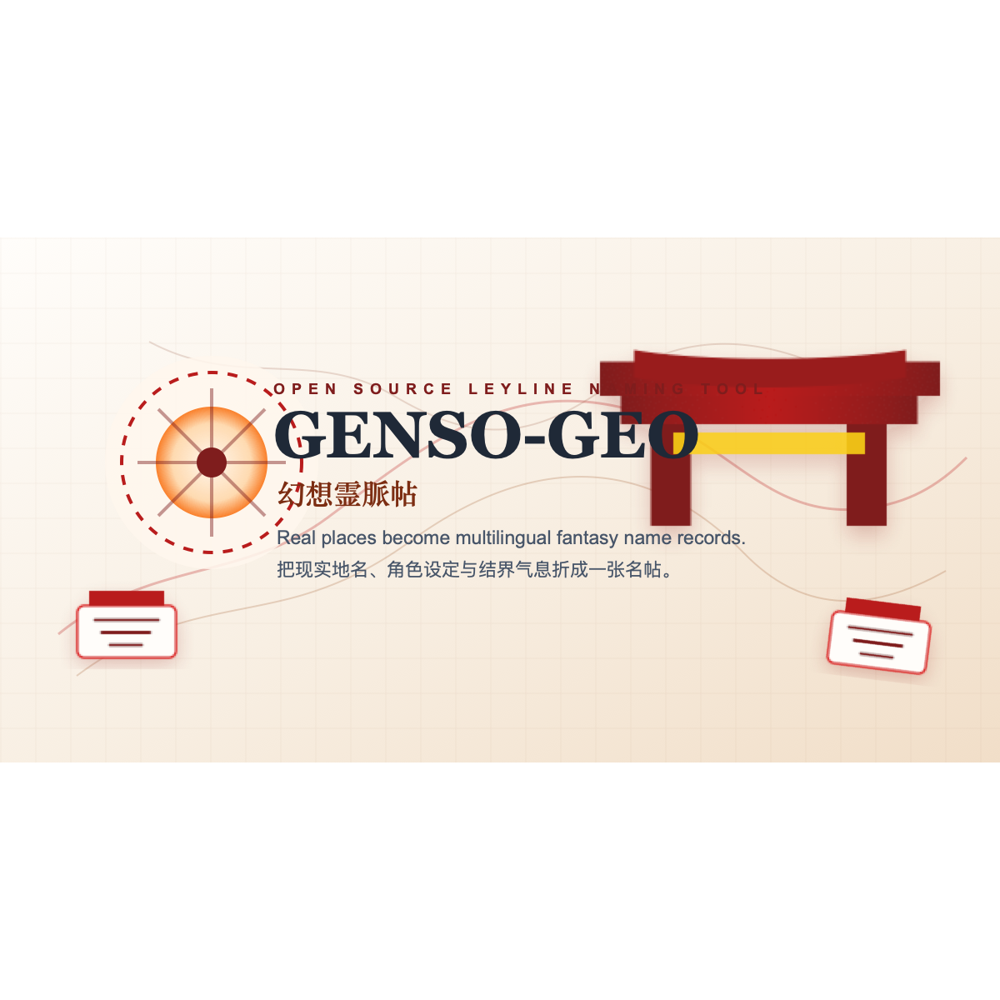

最近又做了一个小站，名字叫 **GENSO-GEO / 幻想霊脈帖**。

如果用一句“博丽神社门口的说明”来讲，它大概是这样的：

> 你把现实里的地名或者角色设定交过来，我把它往结界里晃一晃，最后还你一张带着幻想乡味道的名帖。别一直戳按钮，名字总会出来的。

当然，灵梦真要坐在神社门口收费，可能会先问一句香火钱。不过这个项目是开源的。

<!--more-->

## 这是什么

> 网站：[genso-geo.danzaii.cn](https://genso-geo.danzaii.cn)  
> 仓库：[DanZai233/GENSO-GEO](https://github.com/DanZai233/GENSO-GEO)  
> 作品集：[works.danzaii.cn](https://works.danzaii.cn)

**GENSO-GEO** 是一个东方 Project 风格的地缘幻想命名工具。

它有两种主要用法：

1. 在地图上点一个现实地点，或者搜索一个地名；
2. 输入角色的外貌、性格、背景，让它和一个地理锚点产生“描述共鸣”。

然后它会生成：

- 中文名；
- 英文名；
- 日文汉字名；
- 罗马音；
- 二つ名 / 角色定位；
- 命名由来；
- 可以收藏和导出的符卡式设定卡。

它不是为了“替创作者决定角色最终叫什么”，而是给创作一个可以继续打磨的第一稿。很多时候起名最难的不是最后一锤，而是从完全空白走到“好像有点方向”。这个小站想做的就是把这一步变轻一点。

## 为什么是地名

我一直觉得地名很适合拿来做角色设定的起点。

一个地方会天然带着很多东西：气候、地貌、历史、语言、建筑、传说、颜色、声音。比如京都和黄山给人的感觉完全不一样，西湖和大峡谷也不可能长出同一种角色气质。

所以 GENSO-GEO 没有只做“随机名字生成器”，而是让现实地图成为入口：

- 点击京都，可以往神社、古都、竹林、町屋、山路的方向走；
- 点击西湖，可能会有水、雾、桥、月色和文人气；
- 点击欧洲古堡，气质自然会偏向雾、塔楼、长廊、红茶和旧书；
- 点击北美旷野，名字会带一点外界灵脉和异乡感。

这其实是把“地点”当成创作上下文。AI 生成只是其中一层，真正有趣的是：一个现实坐标会把想象力拉到某个方向上。

## 博丽灵梦式新手引导

这次我给网站加了一个新手引导。

第一次进入时，它会先问你使用什么语言。选完之后，再用一种偏“博丽神社临时说明”的口吻告诉你：

- 这个网站是做什么的；
- 怎么用地图模式；
- 怎么用描述共鸣；
- 怎么收藏和导出；
- GitHub、博客、作品集在哪里。

我没有直接使用官方对白，也没有使用官方图片。语气上只是借了神社、结界、巫女、名帖这些意象，让网站的第一眼更像它自己的世界观，而不是普通工具站的“欢迎使用，请阅读说明”。

对我来说，这种引导不只是帮助用户知道按钮在哪里。它也是网站气质的一部分。

## 两种生成方式

### 地图灵脉定位

这是最直觉的模式。

你可以在地图上直接点击，也可以用搜索框搜索现实地名。地图会放置一个红色灵脉标记，服务端会根据地名、国家、地理类型和角色风格生成名字。

这个模式适合：

- 想从某个真实地点获得角色灵感；
- 给城市、景点、山水、建筑做拟人化；
- 快速随机探索一组地缘角色。

### 描述宿命之契

如果你已经有角色设定，就可以切到描述共鸣。

比如写：

> 一个住在深山神社、喜欢读古籍、能操纵金色落叶的角色。

然后再选择一个地理依附范围，比如日本、华夏古原、欧洲古堡、北美旷野。网站会把角色描述和地理气质揉在一起，生成更贴近设定的名字。

这个模式适合：

- 已经有 OC 设定，但名字还没定；
- 想把角色设定本地化到某个地区；
- 想快速得到中文、英文、日文、罗马音四套可参考文本。

## “少女祈祷中～”和防连点

AI 生成不是瞬间完成的，尤其是多语言字段比较多、模型偶尔慢的时候。

所以我加了一个请求锁：当用户已经选定地点并开始生成后，地图点击、随机生成、搜索结果点选、描述生成都会暂时锁住。界面上会出现一个“少女祈祷中～”的过场，不再让用户误以为没点上，然后连续触发多次请求。

这个细节很实用。它既保护后端，也让用户知道结界还在工作。

灵梦的提醒大概就是：别连点，结界不是赛马券出票机。

## 后端模型对用户无感

这个项目后端支持多种模型供应商：

- Gemini；
- 火山引擎方舟；
- 其他 OpenAI-compatible 服务。

但是用户侧完全不显示模型名，也不显示供应商。前端只关心两个 API：

- `/api/generate-name`
- `/api/generate-description-name`

服务端根据 Vercel 环境变量选择供应商和模型。这样做的好处是：用户体验是稳定的，后端以后换模型、换供应商、调参数，都不需要把这些技术细节丢给用户。

我更喜欢这种方式。一个创作工具应该让人感觉自己在调灵感，而不是在调控制台。

## 技术栈

项目结构不复杂：

| 层 | 技术 |
|---|---|
| 前端 | React 19 + TypeScript + Vite |
| 样式 | Tailwind CSS v4 |
| 地图 | MapLibre + OpenStreetMap / Carto tiles |
| 地理搜索 | Nominatim |
| 后端 | Vercel Serverless Functions |
| AI 接入 | Gemini / Volcengine Ark / OpenAI-compatible |
| 收藏 | localStorage |
| 导出 | html2canvas 生成 PNG |

部署在 Vercel 上，函数执行时间配置到了 300 秒。这样模型慢一点也不至于过早超时。

## 开源以后想怎么继续做

目前 GENSO-GEO 已经能承担基础的地缘命名和设定卡生成，但我还想继续补几件事：

- 更完整的地区预设，比如幻想乡风的“地脉语义标签”；
- 更漂亮的导出卡片模板；
- 更细的角色风格控制；
- 一键生成角色小传；
- 更适合手机端的地图和收藏交互；
- 把生成历史做成可分享的名帖页面。

这个项目最有意思的地方，是它可以继续往“创作辅助工具”和“世界观小玩具”两个方向长。

它可以很实用：帮人起名、翻译、生成设定卡。  
它也可以很没用但很好玩：在地图上乱点，看现实世界被结界重新命名。

这两种感觉我都喜欢。

---

你可以在这里试用：[genso-geo.danzaii.cn](https://genso-geo.danzaii.cn)。  
代码在这里：[github.com/DanZai233/GENSO-GEO](https://github.com/DanZai233/GENSO-GEO)。

如果你已经走到神社门口了，就随便点一个地方吧。名字这种东西，有时候真的要从一条路、一片水、一座山开始。
