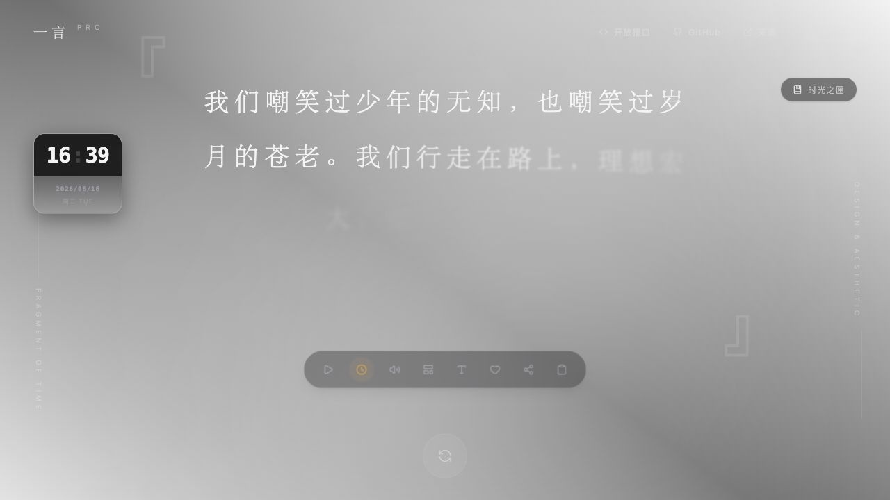
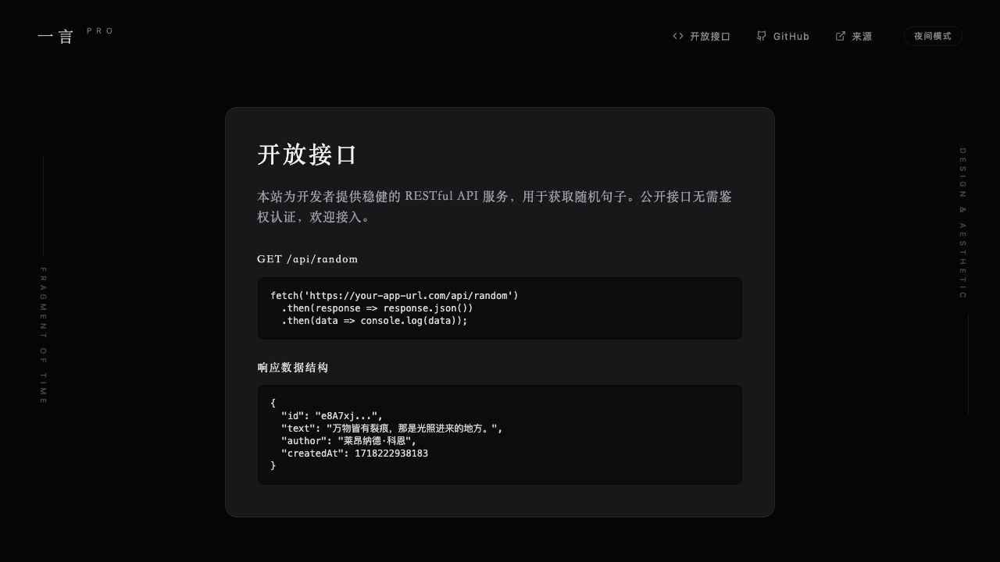

最近又搞了一个小项目：**一言 PRO**。

它是一个部署在 Vercel 上的随机短句站点，也可以叫 Hitokoto。打开页面，会随机出现一句话，有时是动漫台词，有时是文学摘句，有时是很网生、很日常的一小段话。

线上地址：[hitokoto-omega.vercel.app](https://hitokoto-omega.vercel.app)  
GitHub：[DanZai233/Hitokoto](https://github.com/DanZai233/Hitokoto)

<!--more-->



## 它是什么

一言 PRO 的核心很简单：给你一句话。

但我没有把它做成一个只返回 JSON 的接口，而是顺手做成了一个有完整浏览体验的小站。页面里可以切换分类、切换横排和竖排、收藏喜欢的句子、复制和分享、朗读句子，还可以生成适合保存的句子海报。

它有一点像一个小小的情绪抽屉。

有时候打开网页不是为了查资料，也不是为了完成什么任务，只是想看见一句刚好能落到心里的话。这个项目就是围绕这个瞬间做的：不要太吵，不要太重，最好像一张安静的纸。

## 不是只有随机

这次我给它塞了一些偏审美和日常使用的小功能：

- 分类筛选：全部、二次元、文学、哲思、影视、游戏、音乐、网生；
- 横排 / 竖排阅读模式；
- 明暗主题和不同氛围背景；
- 显示时钟，像桌面上的一句话屏保；
- 收藏喜欢的句子；
- 一键复制、分享和朗读；
- 生成不同风格的句子海报；
- Zen mode，用更沉浸的方式自动播放句子。

这些功能单独看都不复杂，但放在一起之后，它就不只是一个“一言 API 示例页面”了。

我很喜欢现在首页的感觉：中间只有一句话，周围留了很多空白，按钮也尽量收起来。它不是那种信息密度很高的工具，而是一个可以短暂停一下的页面。

## 句库怎么来

这次句库不是空手写几条糊弄过去。

项目里现在一共有 **8012** 条短句，来源分成两部分：

| 来源 | 用途 |
|---|---|
| 站内原创和手动维护短句 | 保留自己的句子和整理过的内容 |
| `hitokoto-osc/sentences-bundle` | 导入公开句子包，过滤为短句并映射到现有分类 |

导入时做了一个长度限制，只保留 `length <= 40` 的短句。

这个限制挺重要的。因为一言这种东西，太长就不像“一言”了。短一点，反而更像一句突然出现的旁白，适合放在首页、API、签名档、海报或者桌面小组件里。

现在分类数量大概是这样：

| 分类 | 数量 |
|---|---:|
| 网生 | 2919 |
| 文学 | 2252 |
| 二次元 | 1352 |
| 游戏 | 944 |
| 哲思 | 261 |
| 影视 | 168 |
| 音乐 | 116 |

因为用了第三方句子包，项目里也补了 `THIRD_PARTY_NOTICES.md` 和 AGPL-3.0 许可证副本，把来源、commit 和 bundle 版本写清楚。

这点我觉得还挺有必要的。小项目也可以随手做得规矩一点，尤其是数据来源和开源许可这种东西，不应该靠“应该没事吧”混过去。

## 开放接口

除了网页本身，一言 PRO 也提供了公开 API。



现在主要是两个用法：

```txt
GET /api/random
GET /api/random?category=literature
```

返回的数据结构大概是：

```json
{
  "id": "local-123",
  "text": "万物皆有裂痕，那是光照进来的地方。",
  "author": "莱昂纳德·科恩",
  "category": "literature",
  "createdAt": 1704067200000
}
```

这个接口没有鉴权，也加了 CORS，可以直接给别的小项目接。

比如之后想给博客页脚、个人主页、浏览器起始页、桌面小组件或者某个 Discord / Telegram Bot 接一句随机短句，都可以直接用这个接口。

## 技术结构

这次技术栈是很轻的一套：

- React 19
- Vite 6
- TypeScript
- Tailwind CSS v4
- Vercel Functions
- `api/random.ts`
- 静态句库 `src/data/corpus.json`

最核心的取舍是：**生产环境不依赖数据库**。

以前项目里还保留了从旧 Firestore 导出句子的脚本，但现在真正部署时，只依赖一份静态句库和一个 Vercel Function。Vercel 构建前端，`/api/random` 负责从本地 corpus 里按分类随机抽一句。

这个结构很适合一言站。

它不需要登录，不需要后台，不需要在线投稿审核，也不需要数据库查询。访问量小的时候省心，访问量大一点也比较容易撑住。句库更新时重新导入、重新部署就行。

本地开发时，Vite 里也写了 `/api/random` 的中间件，所以本地页面和 Vercel 线上行为基本一致，不用为了调接口单独起一套服务。

## 最近这波做了什么

从提交记录看，这个项目是 6 月 16 日集中推进了一轮：

1. 初始化 Hitokoto 应用结构；
2. 移除投稿和管理模块，把项目收敛成更轻的随机短句站；
3. 增加 Zen mode 和更多句子展示定制；
4. 把随机接口迁移到 Vercel Function；
5. 改进 `URLSearchParams` 解析，让分类参数更稳；
6. 扩充句库并导入 `hitokoto-osc/sentences-bundle`；
7. 在首页补 GitHub 和来源链接。

这条路线其实很清楚：先从一个更“全”的产品形态里退一步，拿掉暂时不必要的复杂度，然后把真正想保留的部分做好。

我觉得这挺像最近做项目时慢慢形成的习惯。

不一定每个项目都要有账号、后台、数据库、审核流和复杂权限。有时候项目最舒服的状态，就是它只做一件事，然后把这件事做得干净一点。

## 做完之后

一言 PRO 对我来说不是一个很大的项目，但它很适合长期放着。

它可以作为一个独立小站，也可以作为别的项目的内容组件。今天可能只是随机看一句话，以后也许可以继续扩展成：

- 博客侧边栏的一言组件；
- 浏览器新标签页；
- 手机桌面小组件；
- 每日句子订阅；
- 更漂亮的句子海报生成器；
- 给其他应用提供公共短句 API。

这种项目有一种很轻的陪伴感。

它不是为了催你完成什么，也不是为了把你留在页面里很久。它只是安静地给你一句话，然后让你自己决定要不要继续往下走。

我还挺喜欢这种感觉的。

项目地址在这里：[github.com/DanZai233/Hitokoto](https://github.com/DanZai233/Hitokoto)。  
也可以直接打开线上站点：[hitokoto-omega.vercel.app](https://hitokoto-omega.vercel.app)。
