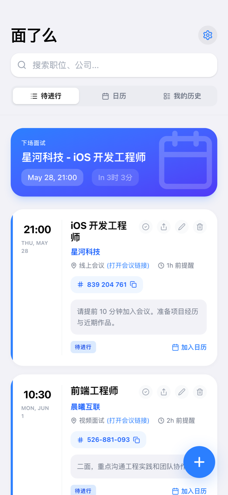

这几天又开了一个新坑，名字叫 **面了么**。

听起来有点像一句灵魂拷问：今天面了吗？结果怎么样？下一场几点？会议号在哪？要不要提前十分钟进去试麦？

做着做着我发现，这个小问题其实还挺真实的。面试邀请经常散落在邮件、微信、飞书、日历、截图和聊天记录里。每一条信息单独看都不复杂，但到了真正要面试前五分钟，人就会突然开始翻：公司名在哪，岗位是什么，Zoom 链接在哪，腾讯会议号是不是这串数字，时区有没有看错。

所以我做了一个把这些东西收拢起来的小工具。

<!--more-->

## 面了么是什么

> 仓库：[DanZai233/mianleme](https://github.com/DanZai233/mianleme)

**面了么** 是一个面试日程管理工具。它可以作为 Web 应用部署，也可以通过 Capacitor 打包成 iOS App。

核心想法很简单：把面试邀请粘进去，或者选一张截图，让 AI 自动提取这些信息：

- 公司
- 岗位
- 面试时间
- 面试平台
- 会议链接
- 会议号
- 备注和密码
- 预计时长

然后这些信息会变成一条可以管理的面试记录。你可以看待进行列表、切到日历视图、归档历史面试，也可以把它加进系统日历。

最开始我只是想做一个“别再找不到会议号”的小工具。结果最近几天一路加功能，慢慢变成了一个比较完整的求职面试小管家。

## 先把面试邀请读懂

这个项目最核心的功能是 **智能识别面试邀请**。

收到一封邮件，或者聊天里 HR 发来一段面试通知，里面可能混着公司、岗位、时间、会议平台、会议链接、会议号、密码和一些注意事项。手动填当然也可以，但体验就很像在做表格。

所以我把 AI 识别放在了新增面试的入口里：

- 可以粘贴面试邀请全文；
- 可以上传截图或照片；
- 服务端统一调用自研 AI 服务；
- 前端只拿结构化结果，不暴露模型厂商和 API Key；
- 支持 Google、OpenAI、Anthropic、火山方舟等后端配置；
- 会按用户时区解析时间，避免跨时区面试看错。

这里有个小细节我还挺在意：会议链接和会议号要分开。

有些邀请里只有一串会议号，AI 如果把它塞进 link 字段，后面打开会议、生成日历、复制会议号都会变得别扭。所以服务端做了一层结果归一化：像 URL 的放链接，不像 URL 的会议数字就放会议号。

这种东西看起来很小，但真用起来会影响安心程度。

## 不只是记录，还要帮我准备

做完日程以后，我又往里面塞了一层面试准备流程。

每条面试记录现在都有准备清单，比如：

- 确认面试时间、平台、会议号和备用联系方式；
- 准备 60 秒自我介绍；
- 挑 2 个最能匹配岗位的项目案例；
- 整理 STAR 故事；
- 准备反问面试官的问题；
- 提前打开会议链接测试麦克风和摄像头。

这部分不是炫技，更多是给自己降噪。面试前真正让人紧张的，经常不是“我完全不会”，而是“我忘了自己该先准备什么”。

后来我又加了 AI 面试准备包和跟进模板：

- 根据公司、岗位、阶段、备注生成 Markdown 准备包；
- 生成可能被问的问题、STAR 案例、反问问题和风险补救话术；
- 面试后可以记录结果、复盘和跟进时间；
- 生成感谢信、进度询问和补充说明模板；
- 文档可以继续对话修改，也可以导出 Markdown。

这样它就不只是一个“日程表”，而是从收到邀约、准备面试、参加面试，到面后复盘和跟进，都能串起来。

## Web 版跑通，再往 iOS 里塞

技术栈这次还是熟悉的那套：

- React 19 + TypeScript
- Vite 6
- Tailwind CSS v4
- Express / Vercel Serverless Functions
- Capacitor iOS
- Swift 原生插件和 WidgetKit

Web 端先把主要流程跑通：新增面试、AI 识别、列表/日历/历史视图、搜索、提醒、冲突检测、备份导入导出、Google 日历和 `.ics` 文件。

然后我开始把它往 iOS 里塞。

这一步比普通 PWA 麻烦得多，但也更有意思。最近几次提交基本都在围着 iOS 原生能力打转：

| 能力 | 做了什么 |
|---|---|
| 原生日历 | iOS 内打开系统日历编辑器，不只是下载 `.ics` |
| 本地提醒 | 根据面试时间和跟进时间同步原生通知 |
| 分享导入 | 从系统分享面板把文字/图片丢进 App，再直接识别 |
| 锁屏小组件 | 展示下一场面试和待进行面试列表 |
| Live Activity | 在灵动岛/锁屏上同步下一场面试状态 |
| 通知扩展 | 通知里显示面试摘要 |
| App Store 素材 | 做了 6.5/6.9 英寸截图、隐私政策、支持页、条款页和上架文案 |

这里最有“真的在做 App”感觉的，是小组件和 Live Activity。

网页工具做到这一步以后，就不只是浏览器里打开一下的东西了。它开始出现在锁屏、通知、系统分享、日历这些更靠近真实生活的地方。对面试这种强时间敏感的场景来说，这种存在感很重要。

## 为 App Store 审核补上该补的东西

这次我还顺手补了一些以前做个人项目时容易忽略的部分：

- 隐私政策页面；
- 使用条款页面；
- 支持页面；
- 营销落地页；
- App Store 中文元数据草稿；
- 隐私标签说明；
- AI 数据共享同意提示。

尤其是 AI 识别这块，我没有让用户在 App 里填 OpenAI、Gemini 之类的第三方 Key，而是统一描述为“面了么自研 AI 服务”。用户只需要知道：他们主动提交的面试文本或图片会发送到服务端用于识别，面试记录默认保存在本地。

这算是这次做项目时比较明显的变化。

以前我经常会先把功能做爽，至于隐私、说明、审核文案、支持页面这些东西以后再说。但如果真的想把一个工具推到手机上，让别人放心使用，这些“边角料”其实不是边角料。它们是产品能不能被信任的一部分。

## 这几天到底干了什么

如果按时间线看，最近几天大概是这样：

1. 先搭了 **面了么** 的基础应用：React 前端、Express API、本地存储、面试记录模型；
2. 接入多模型 AI 服务，让面试邀请可以从文字和截图里自动结构化；
3. 适配 Vercel Serverless Functions，修构建、Node 版本和部署细节；
4. 补移动端体验：视口、日期解析、会议链接、会议号、时区；
5. 加面试复盘、面试准备包、跟进模板和 Markdown 文档编辑；
6. 用 Capacitor 配 iOS 工程、图标、启动图和线上 API；
7. 写 Swift 原生插件，把日历、提醒、分享、小组件、Live Activity 接起来；
8. 做 App Store 截图、隐私政策、条款、支持页和上架信息；
9. 最后又补了一层 AI 共享同意、小组件刷新和审核风险处理。

从提交记录看，5 月 26 日初始化，到 5 月 29 日已经冲到了 iOS 小组件和 Live Activity。这个节奏有点熟悉：一开始只是“做个小工具吧”，三天后已经在处理 App Store 截图和隐私文案了。

嗯，很我。

## 做完之后的感受

面了么和我之前做的一些工具不太一样。

PixelBead 更偏创作，AIMBOT 更偏游戏化训练，LUMINA 更偏想象力和审美。而面了么非常具体：它面对的是一个很现实、很容易焦虑的时刻。

求职面试本身已经够消耗人了。工具不应该再制造新的负担。

所以我希望它最后呈现出来的感觉是：打开以后不用想太多，把邀请丢进去，确认一下信息，然后知道“下一场面试在哪里、什么时候、要准备什么”。

这就够了。

也许它不会是我做过最炫的项目，但它是一个很明确地在解决生活问题的小东西。对我来说，这种项目反而很有成就感。

项目地址在这里：[github.com/DanZai233/mianleme](https://github.com/DanZai233/mianleme)。

如果你也正好在找工作，祝你每一场面试都不再手忙脚乱。更重要的是，祝你拿到想去的 offer。
