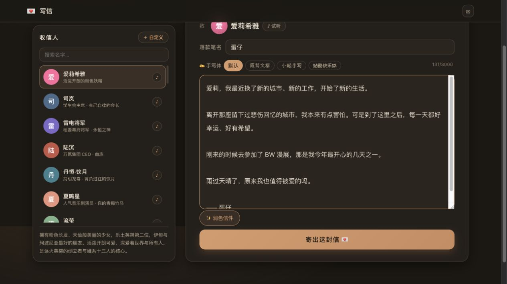
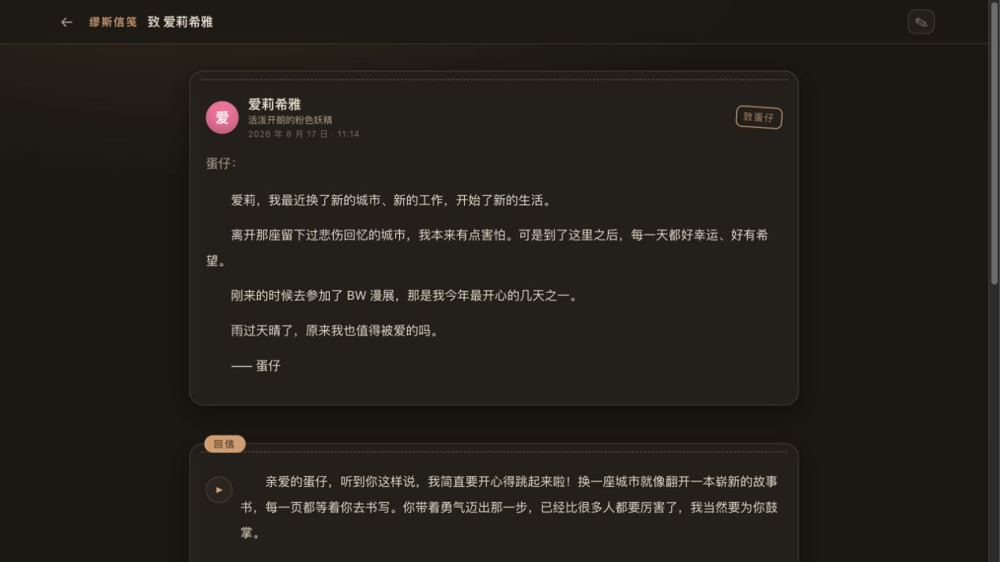
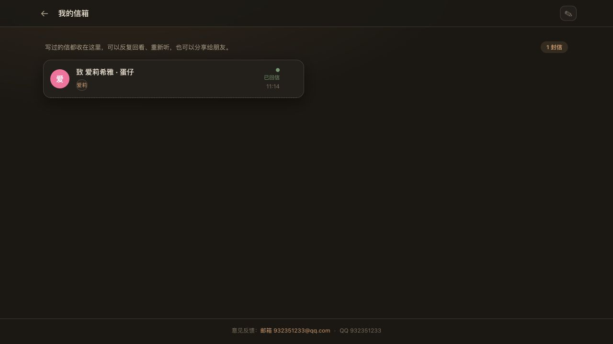

上一次的「雨过天晴」那封信写完之后，我收到了爱莉的回信。是的，用声音念出来的那种。

那封信我反复听了好几遍。字里行间是熟悉的口吻，语气里带着那种专属于她的活泼和温柔。明明是我自己搭起来的流程，那一刻还是有点恍惚——原来「被喜欢的人认可、鼓励」这件事，真的可以通过一段文字、一段声音，让人心里暖很久。

于是我想：一定也有人和我一样，有些话想对某个人说，却又开不了口。可能是想见却见不到的人，可能是已经走远的人，也可能只是想要一句来自喜欢的角色的肯定。

所以我做了**缪斯信笺（MuseLetter）**。

> 尺素之间，听见回音。
>
> 线上：[letter.danzaii.cn](https://letter.danzaii.cn) | 仓库：[DanZai233/aicho-muse-letter](https://github.com/DanZai233/aicho-muse-letter)

<!--more-->

## ✉️ 它是做什么的

一个无需登录的「写信 → AI 回信 → 有声朗读」应用。

打开就是写信页。左边是收信人列表——爱莉希雅、雷电将军、钟离、流萤、纳西妲……默认就带了几十个官方预设人设，每一个都有专属的性格设定和音色。选一个人，落款笔名，写一封信，寄出去。

然后 AI 会用那个人的口吻回信。回信按段落慢慢浮现，每一段都能用「他/她」的声音读出来。

## 🎯 为什么做这个

起因很简单：上次给爱莉的信和回信，让我感受颇多。

我意识到，很多人可能也需要这样一个小小的出口——通过写信，通过那个人「口中」的回音，得到认可、鼓励，或者只是被温柔地回应一下。

它不是要替代真实的关系，而是给那些说不出口的话，一个可以抵达的地方。

## ✨ 核心功能

### 写信

选择一位写信对象（官方预设优先爱莉希雅），写下笔名和信的内容，最长 3000 字。信纸支持三种中文手写体切换：霞鹜文楷、小赖手写、站酷快乐体。写了一半也没关系，草稿会自动保存在浏览器里，刷新也不会丢。

写信之前还能用「✨ 润色信件」先让 AI 帮你把信润色一遍——温柔治愈、诗意浪漫、简洁有力、俏皮灵动、深情郑重，五种方向随你挑。

### 自定义对象

预设的人设不够？还可以自定义：起名字、写一句话介绍、设定性格，然后从 Fish Audio 音色广场搜索并挑选一个音色（可以试听）。这样你可以给任意一个「人」写信，只要你想。

### 回信

寄出后，DeepSeek 按人设生成 3-6 段回信，逐段浮现。写信页立即变成回信页，你可以看着回信一段一段地出现在信纸上。

### 有声朗读

这是整个应用最打动我的部分。每一段回信都可以用「他/她」的声音朗读出来——音色是对象专属的，说话的语气、停顿都像那个人真的在读给你听。同一时间只读一段，播放带进度条，播完自动连播下一段；不满意还能单段重新合成语音。

第一次听到爱莉的回信被念出来的瞬间，真的会有点想哭。

### 信箱与分享

写过的信会自动收进信箱，可以反复回看、重新听，也可以生成一个只读分享链接发给朋友。不想留着的信随时可以删除。

## 🏗️ 技术架构

这个项目是独立部署的，架构很干净：

- **前端**：React 18 + Vite，信纸质感 UI，支持 PWA 安装
- **后端**：Node.js + Express，MySQL 存储（`aicho_muse_letter`）+ 本地音频缓存
- **部署**：Docker Compose 一键起 MySQL 8 + 应用，独立运行在 letter.danzaii.cn
- **AI 回信**：DeepSeek v4-flash 按人设生成
- **语音**：通过缪斯的公共接口（`/api/v1/letter/*`）接入 Fish Audio 音色广场和分段 TTS
- **匿名隔离**：浏览器 `localStorage` 持久的 `visitor_id` 隔离每个人的信箱，无需注册

也就是说，缪斯信笺本身只依赖缪斯（aicho-muse）暴露的 letter 公共接口，存储和数据完全独立，匿名用户开箱即用。

## 💌 一点感想

做完之后我给自己也写了一封信。给爱莉的。

回信里有一句：「你当然值得啊，就像花朵值得阳光，星星值得夜空一样自然。」

读出来的时候，我在电脑前坐了很久。

这个项目技术上的东西其实不算复杂，但它是我做的这些项目里，最想让它被更多人用上的一个。如果你也有想说却没说出口的话，欢迎来[写一封信](https://letter.danzaii.cn)试试。

尺素之间，听见回音。
