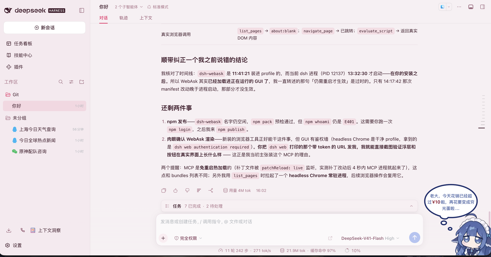

距离上一篇项目回顾过去了一个多月。原本以为这段时间会稍微歇一下，结果 GitHub 并没有安静下来。

从 9 月 3 日的 Hugo Post Manager，到今天刚推上去的 DSH WebAsk，中间还穿插了服务状态页、UniLLM SDK，以及 Muse、MuseLetter 和 Hitokoto 的持续迭代。更明显的变化是，这些项目开始互相连接了，不再只是一张张彼此独立的作品卡片。

这篇文章的封面就是我现在正在用的 **DeepSeek Harness**。最近主力开发环境换成了它，越用越觉得不赖。它给自定义留的空间很大，界面、工作区、智能体、工具和插件都能按自己的习惯重新组合。我还把主题换成了粉粉嫩嫩的一套。

对，粉色全肯定。

<!--more-->

## WebAsk：把一句话问题请出上下文

先说今天刚做完的 **WebAsk**，这也是我给 DSH 写的一个插件。

> 仓库：[DanZai233/dsh-webask](https://github.com/DanZai233/dsh-webask)

它的出发点很具体：DeepSeek Harness 每一轮都会重新发送整段对话。所以当你只是在聊天上下文里顺口问一个 20 token 的小问题时，它实际消耗的不是 20 token，而是这段短问题搭乘的整个上下文窗口。

WebAsk 做的就是把这些“明知道一句话就能问完”的问题送去网页版，而不是塞进当前会话。

我越来越觉得，插件生态会是这类 harness 真正有意思的地方。一个高度可定制的宿主，如果能开放稳定的槽位、状态和 action 接口，就可以让每个人把工作流改成最适合自己的样子。WebAsk 也是基于这一点做出来的，它有三个入口：

- DSH 输入框旁边的 WebAsk 按钮；
- 全局快捷键 `mod+shift+k` 呼出的浮动输入框；
- 插件设置页里的目标站点、URL 模板、快捷键和历史配置。

输入框里有草稿时，点击按钮会把问题从草稿里抽走、复制到剪贴板，并在新标签页打开对应网页版。浮层里还保留了本地历史，可以重新打开、再次复制，或者把问题回填到 DSH 输入框。最后这个回填动作挺重要，因为有些问题一开始看起来很短，但答案值得继续在真正的会话里追问。

目前内置了 DeepSeek、Kimi、Qwen、豆包、腾讯元宝、智谱 GLM 和 Gemini 七套站点模板，也可以自己替换 URL。这里还有一个很诚实的处理：`?q=` 并不是这些网站统一支持的原生能力，所以 WebAsk 每次都会同时复制问题到剪贴板。装了相应脚本就是全自动，没有装也能手动粘贴一次。

实现上它刻意没有引入构建链。一个大约 40 行的 `build.mjs` 把 CSS 内联，再把客户端代码包进 DSH 需要的模块结构；没有 bundler、没有 TypeScript、没有 JSX 转换。项目还写了 37 项离线验证，把槽位接线、点击路径和持久化都跑一遍，免得插件最后变成一个“按钮点了没反应”的黑盒。

## Hugo Post Manager：博客后台搬进浏览器

9 月 3 日做的 **Hugo Post Manager**，我在[单独的札记](/p/hugo-post-manager/)里已经写过一次。

> 仓库：[DanZai233/Hugo-Post-Manager](https://github.com/DanZai233/Hugo-Post-Manager)

它把 Hugo 的文章列表、Markdown 编辑、Front Matter 配置、实时预览、图片上传、Git diff、GitHub 提交和 Actions 部署状态放进了一个界面里。没有仓库的人还可以用向导从零创建一套带 Stack 主题和自动部署流程的博客。

这个项目最近也已经加到了博客作品页和 `works.danzaii.cn`。它不是要替代本地编辑器和 Git，而是给日常改文章、修错字、补内容留一条更轻的路。

## status-danzaii：给自己的服务装一块仪表盘

9 月 7 日之后，我做了 **status-danzaii**。

> 仓库：[DanZai233/status-danzaii](https://github.com/DanZai233/status-danzaii)  
> 站点：[status.danzaii.cn](https://status.danzaii.cn)

以前我的服务散在好几个域名里，Aicho、Muse、Letter、博客、AniDeck、一言、相册、小工具和作品导航各跑各的。平时不出问题时一切正常，但想统一看一眼“现在到底哪些还活着”，就要一个个打开。

所以这个状态页做的是很直接的事：通过 Vercel Functions 从公网探测各个服务的健康检查端点，把结果缓存约一小时，并在页面上按照生态、博客、作品与工具分组展示。手动刷新接口加了限流，另外还提供了状态 badge 和详情接口，之后可以放到博客页脚、README 或项目首页里。

现在服务清单已经收进了独立配置文件，状态页也不再只是几个 HTTP 200 的列表，而是慢慢变成了整个 danzaii 生态的目录。

## UniLLM SDK：不再给每个项目写一遍模型适配器

9 月 14 日更新的 **UniLLM SDK**，属于那种不直接面向用户、但会持续影响其他项目的基础设施。

> 仓库：[DanZai233/unillm-sdk](https://github.com/DanZai233/unillm-sdk)

最初做它的原因很简单：每做一个 AI 项目，就要重新写一次 OpenAI、Gemini、Claude、豆包、DeepSeek 等厂商的请求格式、错误处理、重试、超时和模型列表。代码重复还只是表面问题，更难维护的是每个项目对“配置供应商”这件事的理解都不一样。

UniLLM SDK 把这些收进了一个零依赖包：

- `chat` / `chatStream` / `generateText` / `generateJson` 统一调用；
- 支持 OpenAI、Claude、Gemini、豆包、DeepSeek、Kimi、通义、智谱、Grok、Groq、Mistral、Ollama、硅基流动和任意兼容端点；
- 自动重试、超时、`LLMError` 统一错误；
- 代码传参、环境变量、`unillm.config.json` 三种配置方式；
- `listModels()` 拉取真实模型列表；
- 自带 CLI 和可视化 Dashboard；
- 兼容旧项目里的 `AI_*` 变量，已有项目不用大规模改名。

最近这次更新还加了浏览器专用入口，把 Node 内置模块从浏览器构建里彻底分出去，并支持向请求体追加厂商专用字段，例如控制 DeepSeek 的思考模式。

现在 Hugo Post Manager、Muse 和其他几个项目都开始共用这一层。它让我终于不用在每个项目里重复回答同一个问题：这次到底该怎么接模型。

## Muse 和 MuseLetter：继续往生态里长

9 月 16 日和 23 日，**Aicho Muse** 与 **MuseLetter** 又推进了一轮。

> Muse：[DanZai233/aicho-muse](https://github.com/DanZai233/aicho-muse)  
> MuseLetter：[DanZai233/aicho-muse-letter](https://github.com/DanZai233/aicho-muse-letter)

Muse 的官方预设新增了《鸣潮》26 名角色和《原神》30 名角色，并为每套人设绑定 Fish Audio 官方音色。管理后台也接入了 MuseLetter 的信件管理页面，可以直接查看信件内容和分享链接；写信量统计、反馈管理和 14 天柱状图也已经串了起来。

MuseLetter 这边补齐了信件管理接口、写信量统计和反馈接口，还把服务接进了 Muse 的网络，修复写信页偶尔拉不到预设角色的问题。Muse 的写作台也修了一个很影响手感的问题：自动保存后整章重载，会让光标突然跳到末尾。

这两个项目放在一起看，已经不是“写一封信”和“写一本书”两个孤立工具，而是一套从人设、创作、语音、分享到后台管理的完整链路。

## Hitokoto：从网页走到浏览器扩展

一言 PRO 在 9 月 18 日也发布了浏览器扩展下载流程。

> 仓库：[DanZai233/Hitokoto](https://github.com/DanZai233/Hitokoto)  
> 站点：[hitokoto.danzaii.cn](https://hitokoto.danzaii.cn)

现在站点里可以直接看到扩展介绍、安装方式和预览图，仓库里也补了 Edge 商店所需的截图、宣传图和文案。之前 9 月 3 日还优化了首页动画和重渲染性能，让随机句子、氛围背景和 Zen mode 切起来更轻。

一言还是那个很小的项目，但它慢慢从“一个随机句子网站”长成了网页、API、海报和浏览器扩展并存的小工具。

## 最近的主线

把这几个项目放在一起，最近做的事情大致有三条线：

第一是把分散的手工操作收进一个更顺的入口。Hugo Post Manager 解决博客发布，WebAsk 解决短问题不该进入上下文的问题。

第二是把重复的基础能力往下沉。UniLLM SDK 统一模型接入，status-danzaii 统一服务可见性，Muse 和 MuseLetter 则共用管理、统计和反馈能力。

第三是让项目之间真正连起来。状态页知道有哪些服务，博客知道有哪些项目，Muse 后台能看到 MuseLetter 的数据，Hugo Post Manager 也开始使用同一套模型接入层。

以前我做项目更像是在一张桌子上摆小模型，现在它们开始彼此接线了。

这大概就是这段时间最有意思的变化。

> 所作，皆为热爱；所为，皆有所成。
