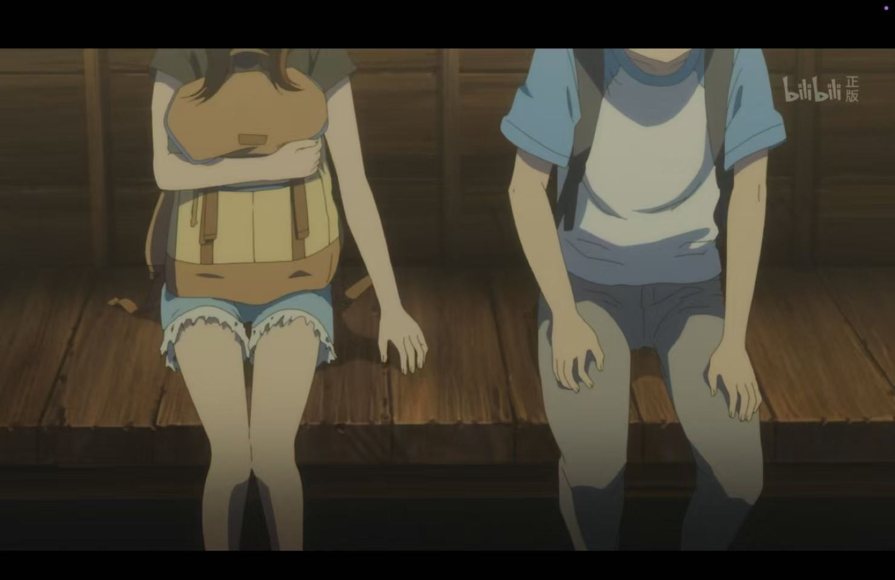

今天看了《擅长捉弄的高木同学》剧场版。

看完之后整个人有点软掉。

不是那种被大起大落剧情狠狠砸中的感觉，而是很轻、很慢、很温柔地被击中。像夏天晚上吹过来的风，明明没有很用力，却让人突然觉得：啊，原来这样的喜欢也可以存在。

又相信爱情了。

<!--more-->

## 好美好啊

高木同学最打动我的地方，一直不是“捉弄”本身。

而是她明明总是在笑，明明总是把喜欢藏在玩笑和轻轻的试探里，但那份心意又很稳定。不是忽冷忽热，不是吊着你，也不是靠激烈的拉扯证明存在感。

她就是一直在那里。

会看着你，会记得你，会把你的笨拙也当成可爱的部分，会用自己的方式告诉你：我选择你。

这种感觉真的太好了。

有时候看纯爱作品，最让人破防的不是告白，也不是牵手，而是一个人很认真地、很长久地、很自然地对另一个人好。不是一时兴起，不是气氛到了，而是从很多很多小事里都能看出来：你在我这里是特别的。

## 什么时候可以遇见我的高木同学呢 QAQ

看完之后就会忍不住想，什么时候可以遇见我的高木同学呢。

不是一定要像作品里那样天天捉弄我，也不是一定要有多轰轰烈烈的剧情。

只是希望有一天，也能遇见一个人：

- 会坚定地选择我；
- 会真心地对待我；
- 不会把喜欢当成消耗和博弈；
- 不会让我一直猜自己到底重不重要；
- 会愿意和我一起过很多普通但很安心的日子。

我好像越来越喜欢这种“日常里的确定感”。

不是今天很热烈，明天就消失；也不是靠患得患失维持心动。而是两个人都愿意把对方放进自己的生活里，愿意一起走路、一起吃饭、一起看海、一起沉默，也一起把没说出口的话慢慢说清楚。

## 纯爱最美的地方

纯爱最美的地方，可能就是它会让人重新相信“真心”这件事。

现实里很多关系都太复杂了。大家会权衡，会试探，会怕输，会怕认真之后没有回应。所以很多时候，喜欢还没真正说出口，就已经先被保护壳包起来了。

但高木同学这种作品会提醒我：喜欢也可以很简单。

我喜欢你，所以想逗你笑。

我喜欢你，所以想和你一起走更远的路。

我喜欢你，所以哪怕只是坐在旁边，也会觉得这一刻很好。

这种好不是幼稚，而是很珍贵。

因为能认真喜欢一个人，本来就需要勇气。能持续地、温柔地、坚定地对待一个人，更需要很好的心。

## 也想画这样的日常

最近本来就在想画校园纯爱日常，从初中到大学，画那种慢慢长出来的喜欢。

看完剧场版之后，这个念头更强了。

我想画的不是特别华丽的恋爱，不是动不动就误会、争吵、分开、追逐的戏剧。更想画一些很小的瞬间：

- 放学后一起值日；
- 晚自习时递过来的便利贴；
- 雨天同撑一把伞；
- 高考后没说出口的话；
- 大学后隔着城市发来的照片；
- 很多年以后回头看，才发现原来每一件小事都在说喜欢。

可能我真正想画的，是一种“被坚定选择”的感觉。

一个人看见你的别扭，也看见你的认真；看见你嘴硬，也看见你其实很希望被好好对待。然后没有嘲笑你，也没有离开，而是很温柔地站在那里。

这大概就是我今天被高木同学击中的地方。

## 最后

今天真的又相信爱情了。

虽然现实里的高木同学不知道在哪里，也不知道什么时候会出现。

但至少这一刻，我还是愿意相信：世界上会有那样真心、稳定、温柔的喜欢。会有人不是因为一时新鲜靠近你，而是认真地选择你，认真地对待你，认真地想让你幸福。

就像截图里的那句话一样：

> 我也会让你幸福的。

呜。

什么时候可以遇见我的高木同学呢 QAQ
